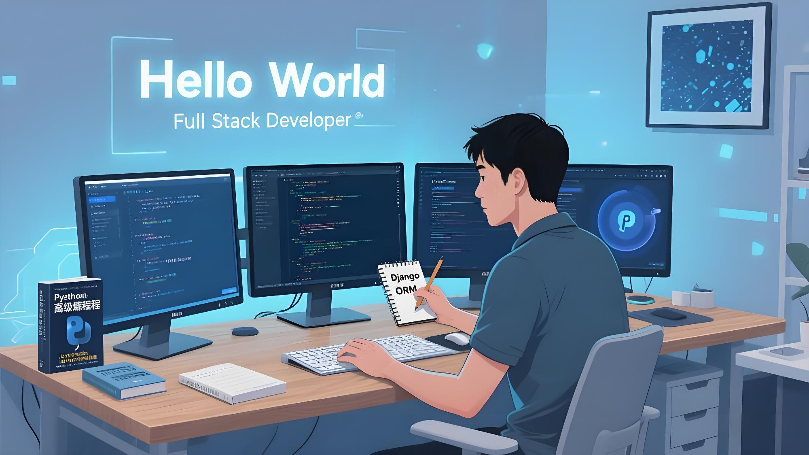
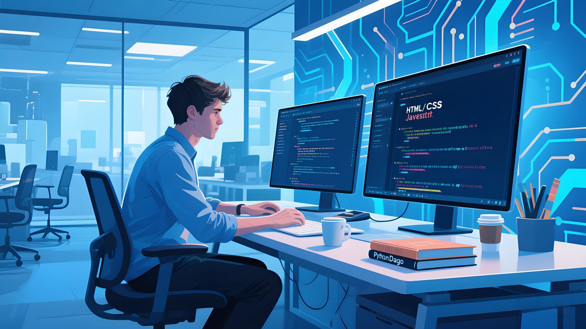

  <!-- 响应式图片方案 -->
  

## 👋 关于我
- 🏫 全栈开发学习者 | Python后端开发
- 💻 技术栈：HTML/CSS/JavaScript + Python/Django
- 📚 当前重点：Django框架与数据库设计
- 👤 艾阳，AI科技爱好者，热衷于探索前沿技术并将其应用于实际项目中。

## 🛠 技术栈

  
  
  
  
  

## 📊 GitHub 统计

  
  

## 🎓 学习与项目
- **项目经验**：参与了多个全栈开发项目，积累了丰富的前后端开发经验。
- **学习经历**：持续学习最新的前端框架和技术，如React和Vue.js，以及后端技术如Flask和FastAPI。

## 🌟 兴趣爱好
- **AI科技**：对人工智能和机器学习有浓厚的兴趣，参与了一些相关的研究项目。
- **科技探索**：喜欢探索最新的科技趋势和技术动态，关注前沿科技的发展。

</style>

  

