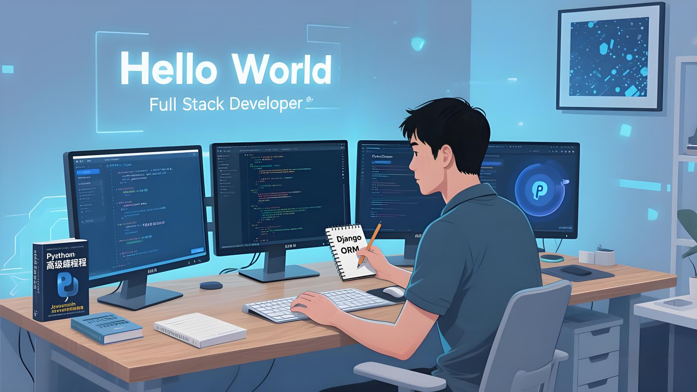

# 🚀 技术探索者

  
   
  

## 👋 关于我

- 🏫 全栈开发学习者 | Python后端开发
- 💻 技术栈：HTML/CSS/JavaScript + Python/Django
- 📚 当前重点：Django框架与数据库设计
- 👤 AI科技爱好者，热衷于探索前沿技术并将其应用于实际项目中

## 🛠️ 技术栈

  
  
  
  
  
  

## 📊 GitHub 统计

  
  
   
  

## 🌟 开源项目

- [QuickCompress](https://github.com/aiyangdie/QuickCompress) - 快速图片压缩工具
  - 基于JavaScript开发
  - 支持批量图片处理
  - 保持图片质量的同时减小体积
  - 简单易用的界面设计

- [wechat-whack-a-mole](https://github.com/aiyangdie/wechat-whack-a-mole) - 微信小游戏：打地鼠
  - 基于微信小程序开发
  - 有趣的游戏玩法
  - 流畅的动画效果
  - 完整的游戏逻辑

- [VideoHub](https://github.com/aiyangdie/VideoHub) - 视频资源管理平台
  - 使用CSS3实现精美界面
  - 响应式设计
  - 视频分类管理
  - 用户友好的交互

- [Bookmark-Validator](https://github.com/aiyangdie/Bookmark-Validator) - 书签验证工具
  - HTML5技术实现
  - 书签有效性检查
  - 批量处理功能
  - 导出报告功能

- [retro-games-hub](https://github.com/aiyangdie/retro-games-hub) - 复古游戏集合
  - JavaScript游戏开发
  - 经典游戏复刻
  - 响应式设计
  - 跨平台支持

- [ictupian](https://github.com/aiyangdie/ictupian) - IC智能图片压缩
  - 智能压缩算法
  - 批量处理功能
  - 保持图片质量
  - 简单易用的界面

## 🎯 技术探索

- **前端开发**：专注于Web前端技术
  - HTML5/CSS3
  - JavaScript
  - 响应式设计
  - 用户体验优化

- **游戏开发**：探索游戏开发技术
  - 微信小程序
  - 复古游戏
  - 游戏逻辑
  - 动画效果

- **工具开发**：开发实用工具
  - 图片处理
  - 书签管理
  - 视频管理
  - 效率工具

## 📈 学习计划

- **近期目标**
  - 深入学习Django框架
  - 掌握数据库优化技术
  - 提升前端开发能力
  - 参与开源项目贡献

- **长期规划**
  - 全栈开发能力提升
  - AI技术应用研究
  - 技术社区建设
  - 开源项目维护

  
   
  

 
