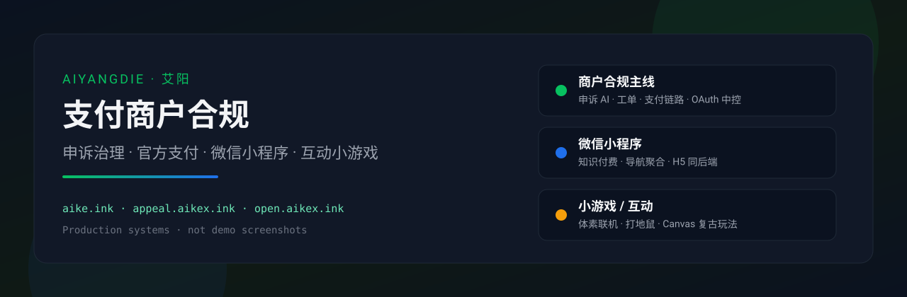
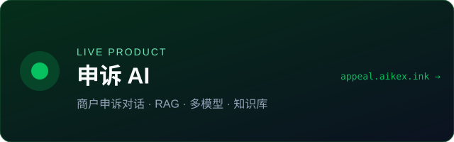
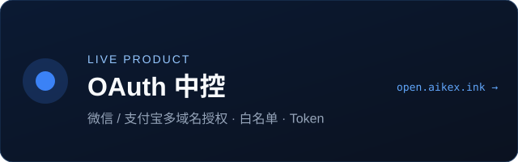
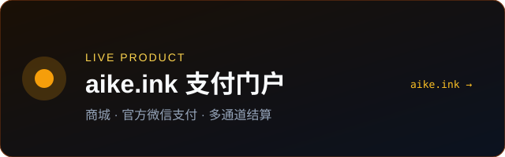

<!--
  aiyangdie · GitHub Profile
  Visual + code + product cards · merchant compliance first
-->

<div align="center">




<br/>

[](mailto:aike1015@qq.com)
[](https://aike.ink/)
[](https://github.com/aiyangdie)
[](https://github.com/aiyangdie)

</div>

---

## 定位

我做 **支付商户合规** 相关的生产系统：申诉对话、工单运营、官方支付与多域名 OAuth。  
同一套交付能力覆盖 **微信小程序 / H5**，并用开源仓库沉淀 **小游戏与工程工具**。

| 主业 | 生态 | 玩法 |
|:----:|:----:|:----:|
| 申诉 · 支付 · 合规中台 | 小程序 · 知识付费 · 授权中控 | 体素联机 · 微信小游戏 · Canvas |

```ts
// 交付边界：线上可跑 · 密钥不上库 · 商业源码私有 · 工具开源
type Delivery = {
  prod: 'appeal' | 'oauth' | 'wechat-pay' | 'mini-program' | 'game'
  source: 'private' | 'open'
  ops: 'nginx' | 'pm2' | 'actions'
}
```

---

## 主业产品 · 可点开

<div align="center">

<a href="https://appeal.aikex.ink/chat/"></a>

<a href="https://open.aikex.ink/docs"></a>

<a href="https://aike.ink/"></a>

</div>

### 代码感 · 合规流水线（示意）

```ts
/** 商户申诉：检索知识库 → 生成材料草稿 → 校验商户态 → 开单 */
type AppealCase = {
  merchantId: string
  channel: 'wechat' | 'alipay' | 'epay'
  reason: string
}

async function handleAppeal(input: AppealCase) {
  const ctx = await rag.retrieve(input)          // 合规知识 / 历史案例
  const draft = await llm.compose(ctx, input)    // 申诉说明草稿
  await pay.verifyMerchant(input.merchantId)     // 支付侧商户状态
  return ticket.open({ draft, status: 'ready' })
}
```

```php
// OAuth 中控：多域名 redirect_uri 白名单（ThinkPHP 风格示意）
public function callback() {
    $state = cache('oauth:' . input('state'));
    abort_unless($state && in_array($state['redirect'], $this->whitelist, true), 403);
    $token = $this->provider->exchange(input('code'));
    return redirect($state['redirect'] . '?token=' . urlencode($token));
}
```

私有交付还包括：申诉全链路后台、易支付 / 微信支付对接、Agent Skills、材料自动化——**源码不公开，能力可交付**。

---

## 微信小程序 & 生态

<div align="center">

<a href="https://github.com/aiyangdie/WexOpen"></a>&nbsp;
<a href="https://github.com/aiyangdie/sms-verify-kit"></a>

</div>

| 项目 | 说明 | 线上 |
|:-----|:-----|:-----|
| [**KnowledgeLinkerX**](https://github.com/aiyangdie/KnowledgeLinkerX) | 小程序导航聚合 · 二维码收录 | [keji.aikex.ink](https://keji.aikex.ink/) |
| [**sms-verify-kit**](https://github.com/aiyangdie/sms-verify-kit) | 号码认证 SDK · 登录绑机 | 开源 |
| [**WexOpen**](https://github.com/aiyangdie/WexOpen) | Windows 微信多开 · CI 出包 | 开源 |
| 知识付费 H5 | 小程序 + H5 同后端 | [h5.aikex.ink](https://h5.aikex.ink/) |

```js
// 小程序侧：统一后端会话（示意）
wx.login({
  success: async ({ code }) => {
    const { token } = await api.post('/auth/mp', { code })
    wx.setStorageSync('token', token)
  }
})
```

---

## 小游戏 & 互动

<div align="center">

<a href="https://github.com/aiyangdie/mc-aikex-ink"></a>&nbsp;
<a href="https://github.com/aiyangdie/wechat-whack-a-mole"></a>

<a href="https://github.com/aiyangdie/retro-games-hub"></a>&nbsp;
<a href="https://github.com/aiyangdie/feiji"></a>

</div>

| 项目 | 玩法 | 入口 |
|:-----|:-----|:-----|
| [**mc-aikex-ink**](https://github.com/aiyangdie/mc-aikex-ink) | 体素沙盒 · 服务器权威联机 | [**在线玩**](https://mc.aikex.ink/) |
| [**wechat-whack-a-mole**](https://github.com/aiyangdie/wechat-whack-a-mole) | 微信打地鼠 · 计分排行 | 仓库 |
| [**retro-games-hub**](https://github.com/aiyangdie/retro-games-hub) | Canvas 复古合集 | 仓库 |
| [**feiji**](https://github.com/aiyangdie/feiji) · [**cf-game**](https://github.com/aiyangdie/cf-game) | 射击 / 街机小品 | 仓库 |

```js
// 联机原则（mc.aikex.ink）：服务器写真实状态，客户端只渲染
room.tickMobs(dt)                 // 权威步进：贴地 / 寻路 / 卡住脱困
socket.broadcast({ t: 'mobs', list: room.mobsArray() })
```

---

## 开源工具

<div align="center">

<a href="https://github.com/aiyangdie/ictupian"></a>&nbsp;
<a href="https://github.com/aiyangdie/internal-chat"></a>

</div>

| 仓库 | 一句话 |
|:-----|:-------|
| [**ictupian**](https://github.com/aiyangdie/ictupian) | 浏览器图片压缩 · [ic.aikex.ink](https://ic.aikex.ink/) |
| [**internal-chat**](https://github.com/aiyangdie/internal-chat) | 局域网 P2P 聊天传文件 |
| [**-ContractAI**](https://github.com/aiyangdie/-ContractAI) | AI 合同生成 · 法务材料辅助 |
| [**cursor-boost**](https://github.com/aiyangdie/cursor-boost) | Cursor 排障一键修复 |

---

## 技术栈

<div align="center">


</div>

`React / Vue` · `Node` · `PHP (ThinkPHP)` · `Python` · `微信小程序` · `Nginx / PM2 / Actions`

---

## 活跃度

<div align="center">


</div>

---

<div align="center">

## 合作

**商户申诉 / 合规系统** · **微信支付与 OAuth** · **小程序与小游戏定制**

[邮箱](mailto:aike1015@qq.com) · [官网 aike.ink](https://aike.ink/) · [申诉 AI](https://appeal.aikex.ink/chat/) · [OAuth 文档](https://open.aikex.ink/docs)

<sub>Production first · Private for clients · Open source for leverage</sub>

</div>
